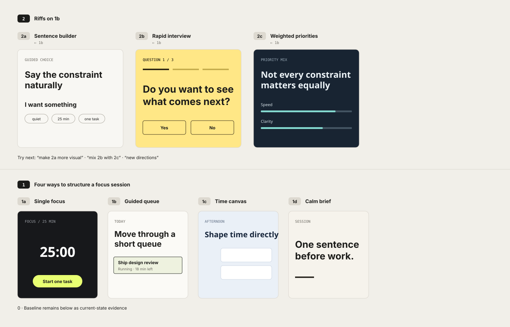
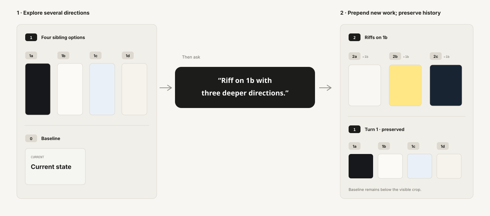

# Parallel Design Exploration

**Explore multiple rendered design directions side by side, keep every exploration turn visible, and converge only when you are ready.**

Parallel Design Exploration is an Open Design community scenario for **persistent parallel prototyping**. Instead of replacing yesterday's design with today's revision, it turns the artifact itself into a visible design space.



The canonical demo above is generated from the same Options Canvas grammar used by the skill: newest work at the top, earlier turns still visible, and stable ids connecting the canvas back to conversation.

```text
TURN 3    3a     3b     3c          ← newest

TURN 2    2a     2b     2c
            ↖     ↑     ↗
                  1b

TURN 1    1a     1b     1c     1d

0 · BASELINE                         ← when reliable current UI exists
```

You can point at any visible state by id — `1b`, `2a`, `3c` — and ask the agent to riff on it, combine it with another direction, or explore a different axis. New work appears as a new turn while the design history stays on the same canvas.

## Why this exists

Most AI design loops converge too early:

```text
brief → one design → edit → replace → edit
```

That makes it difficult to compare alternatives, recover an earlier idea, or understand how a later direction evolved.

Parallel Design Exploration uses a different loop:

```text
brief
  ↓
render several sibling options
  ↓
compare them at the same time
  ↓
reference any option by stable id
  ↓
add a new turn without erasing the old one
  ↓
converge when the user chooses
```

The interaction model is inspired by parallel prototyping, design-space exploration, studio pin-ups, artboards, and persistent visual workspaces.

## Install

Install directly from GitHub:

```bash
od plugin install github:tungloong/parallel-design-exploration
```

Then open Open Design and select **Parallel Design Exploration** as the Active Plugin. It is a standalone scenario; you do not need to start from Web Prototype first.

The plugin requests only:

```text
prompt:inject
```

so it stays compatible with the Open Design community-plugin trust model.

If Open Design already has an older copy installed, remove or reinstall that copy before testing the latest manifest and skill package.

## Quick start

Start with an ordinary design brief. You do not need to describe the exploration mechanics yourself.

```text
Redesign this search flow. I want to make choosing the destination much faster without turning the screen into a dense control panel.
```

A first turn might produce:

```text
1a   input-first
1b   destination-first
1c   command-style
1d   system-native
```

Then continue conversationally:

```text
Along 1b, explore three different ways to organize the destinations.
```

or:

```text
Combine 2a's hierarchy with the interaction from 1c.
```

or:

```text
Give me new directions instead of refining the current family.
```

The important part is that `1b`, `2a`, and the earlier alternatives remain visible and addressable while the exploration grows.

## How a follow-up grows the canvas



A normal continuation is an additive state transition. The new turn is inserted at the top of the same primary artifact; already delivered turns remain the visible source-of-truth history. This is different from regenerating a prettier summary of the old work.

## What the plugin provides

### Parallel rendered options

Each turn contains a compact set of **materially different, rendered siblings** rather than a list of textual concepts. The exact count is driven by the brief or by an explicit user request.

Sibling options are developed to a comparable level of craft and fidelity so the comparison reflects the design hypotheses rather than uneven execution quality.

### Stable design identities

Conversation uses short logical ids:

```text
1a  1b  1c  1d
2a  2b  2c
```

The HTML uses selector-safe DOM anchors such as `o-1b`, while `data-option="1b"` and the visible label remain `1b`. This keeps conversational identity simple without creating invalid CSS/JavaScript selectors.

### Persistent visible history

One exploration session keeps **one primary artifact identity**. A normal follow-up locally prepends a new turn to that artifact:

```text
before                 after

Turn 1                 Turn 2   ← new
0 · Baseline           Turn 1   ← preserved
                       0 · Baseline
```

When the host exposes targeted file editing, the preferred mutation is a local insertion immediately inside `main.pde-canvas`. Previously delivered state subtrees are left untouched.

See [`references/artifact-state-mutation.md`](references/artifact-state-mutation.md) for the state model.

### Optional `0 · Baseline`

If the supplied code, screenshot, design file, or prior artifact contains a reliable current state, the canvas preserves it as **`0 · Baseline`**.

Baseline means **what exists now**. It does not mean the new directions must inherit the current design. Baseline evidence and design lineage are separate concepts.

Greenfield work simply begins at Turn 1.

### Lineage

Later options can record intentional descent:

```html
<article id="o-2a" data-option="2a" data-parent="1b">
```

This makes design ancestry visible without forcing every new idea to inherit from the baseline or from the immediately previous turn.

## The Options Canvas

The primary artifact is one visible exploration document. `main.pde-canvas` owns the complete workspace, ordered newest-first:

```html
<body>
  <main class="pde-canvas">
    <section class="pde-turn" id="t2" data-turn="2">
      <article id="o-2a" data-option="2a" data-parent="1b">...</article>
      <article id="o-2b" data-option="2b" data-parent="1b">...</article>
    </section>

    <section class="pde-turn" id="t1" data-turn="1">
      <article id="o-1a" data-option="1a">...</article>
      <article id="o-1b" data-option="1b">...</article>
    </section>

    <section class="pde-baseline" id="baseline" data-baseline="0">
      ... faithful current-state evidence ...
    </section>
  </main>
</body>
```

The canvas chrome is intentionally small and stable: compact state labels, thin temporal separators, transparent option containers, a light artifact surface, and spatial sibling layout. Wide artboards keep their authored width and can scroll horizontally when the host viewport is narrower.

The **designs inside the options are not styled by the protocol**. Their visual language, typography, palette, interaction model, fidelity, and platform behavior come from the user's brief, the project context, and the host's design guidance.

See the current marketplace/example artifact:

- [`examples/single-document-exploration.html`](examples/single-document-exploration.html)
- [`templates/exploration-board.html`](templates/exploration-board.html)

## What is intentionally left open

Parallel Design Exploration standardizes the **design-space interaction model**, not a universal visual style.

It owns:

- one persistent primary exploration artifact;
- newest-first turns;
- stable logical option ids;
- selector-safe DOM anchors;
- visible historical states;
- optional baseline evidence;
- lineage between descendants and parents;
- direct sibling comparison;
- a thin, stable workspace substrate.

It leaves the following to the actual design task and host/model:

- product domain;
- visual direction;
- typography and palette;
- platform conventions;
- interaction details;
- option-specific reasoning and annotations;
- the moment of convergence.

## Open Design integration

The plugin is packaged as a community-safe standalone scenario:

```text
kind: scenario
taskKind: new-generation
mode: prototype
surface: web
capabilities: [prompt:inject]
```

Open Design can still contribute host-level discovery, craft, and design-direction guidance. The skill preserves the persistent Options Canvas interaction model around that work.

The executable contract lives in [`SKILL.md`](SKILL.md); Open Design-specific packaging lives in [`open-design.json`](open-design.json).

## Validation

The repository includes a lightweight standard-library validator and GitHub Actions workflow.

Run locally:

```bash
python scripts/validate.py
```

It checks the pieces most likely to fail silently:

- portable Agent Skills frontmatter keys;
- `SKILL.md` / `open-design.json` version alignment;
- preview and template anchor integrity;
- logical `data-option` ↔ selector-safe `o-*` DOM ids;
- turn ids and `data-turn` alignment;
- preview entry existence;
- canonical canvas-substrate drift.

For Open Design itself, also run:

```bash
od plugin validate .
```

## Project structure

```text
.
├── SKILL.md                         # executable Agent Skill contract
├── open-design.json                 # Open Design scenario manifest
├── assets/demo/                     # README / community-submission media
├── examples/
│   ├── single-document-exploration.html
│   └── mobile-ui-exploration.md
├── templates/
│   └── exploration-board.html
├── references/                      # method and maintainer rationale
├── scripts/
│   └── validate.py
└── .github/workflows/
    └── validate.yml
```

The skill is self-contained for runtime use. The supporting files document the rationale, demonstrate the protocol, and help maintainers verify the package; they are not prerequisites that an agent must load before every run.

## Method references

The protocol is grounded in established design practice rather than a single product implementation. Background material is collected in:

- [`references/parallel-prototyping.md`](references/parallel-prototyping.md) — divergence and parallel prototyping;
- [`references/exploration-canvas.md`](references/exploration-canvas.md) — spatial comparison and persistent visual workspaces;
- [`references/persistent-options-canvas.md`](references/persistent-options-canvas.md) — stable option identities and visible history;
- [`references/artifact-state-mutation.md`](references/artifact-state-mutation.md) — artifact identity and historical-state mutation;
- [`references/canvas-substrate.md`](references/canvas-substrate.md) — stable workspace chrome vs. generative design content;
- [`references/open-design-community-alignment.md`](references/open-design-community-alignment.md) — packaging decisions for the Open Design ecosystem.

## Status

**v0.10.1 — public-beta hardening.**

The core interaction protocol has been exercised across multiple model/agent combinations and multi-turn explorations. v0.10.1 focuses on portability and silent-failure prevention: selector-safe anchors, wide-artboard overflow behavior, targeted follow-up mutation, accessible reference affordances, portable Agent Skills frontmatter, and automated repository validation.

The next public-facing work is a tagged beta release and an Open Design community submission. A real runtime screen recording can be added later without changing the canonical demo assets above.

## License

MIT.
